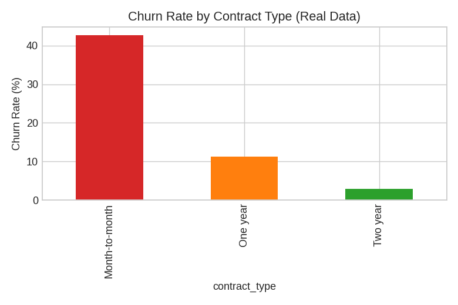
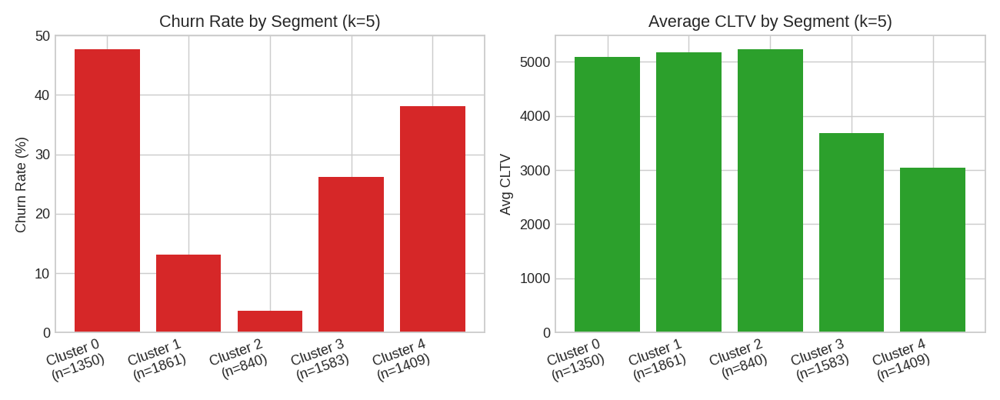
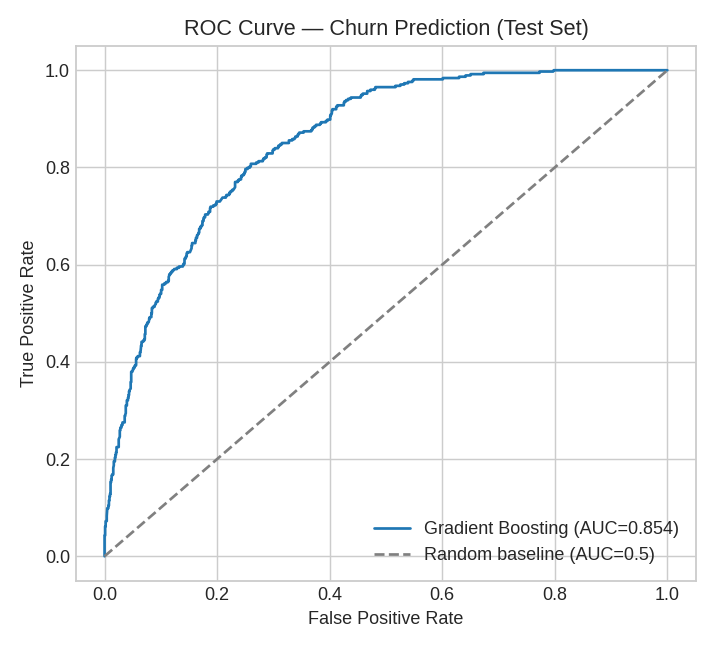
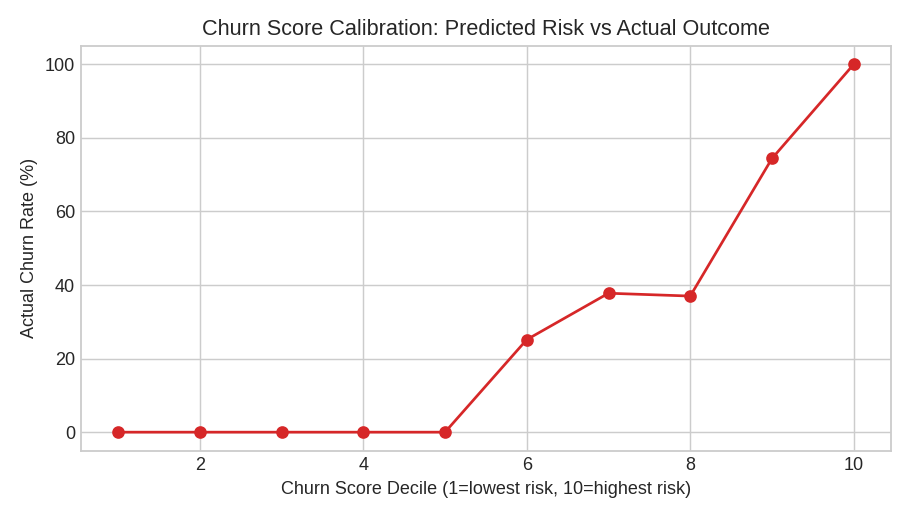
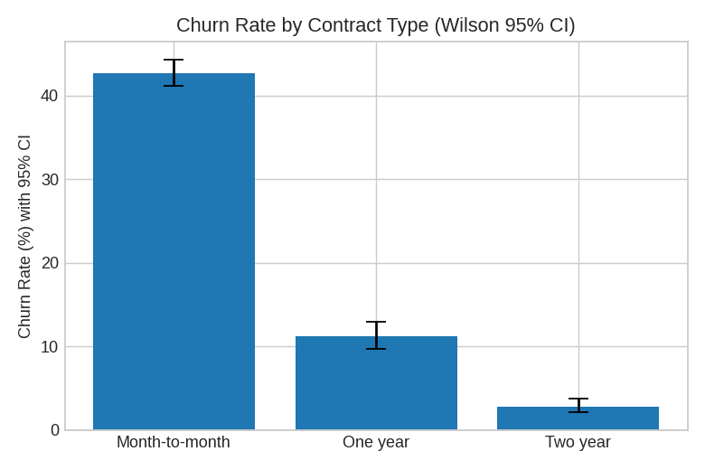
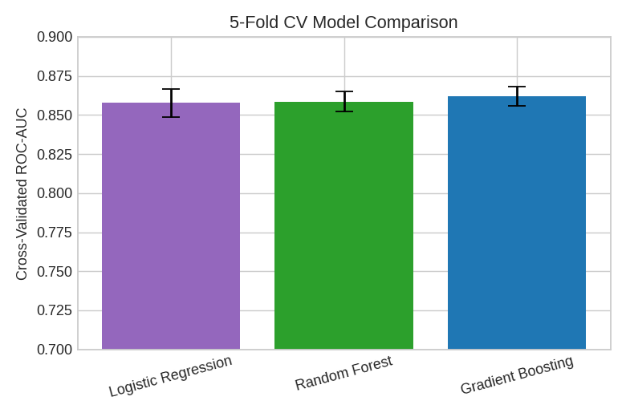

# Customer Subscription & Churn Intelligence Platform
     

This is a full analytics project I built around 7,043 real telecom customers and $139,130.85/month in recurring revenue currently at risk from churn. It goes from a raw IBM Excel/CSV export, through a PostgreSQL star-schema database, into statistics, five machine learning models, and a 9-page executive Power BI dashboard.

I wanted this to cover the whole analytics stack, not just a notebook with some charts — data engineering, SQL, stats, ML, and BI, the way these things actually get built.

**Relevant for:** Data Analyst · BI Developer · Analytics Engineer · Data Scientist roles.

<!-- PLACEHOLDER: once deployed, replace this line with your real Streamlit Community Cloud URL -->
**🔗 Live demo:** _[deployment in progress]_ · **📊 Dataset:** [IBM Telco Customer Churn on Kaggle](https://www.kaggle.com/datasets/blastchar/telco-customer-churn)

---

## A few things this project actually produced

| Churn by contract type | ML segmentation (5 clusters) | Churn model ROC curve |
|:---:|:---:|:---:|
|  |  |  |

| Churn score calibration | Statistical confidence intervals | Model comparison (CV) |
|:---:|:---:|:---:|
|  |  |  |

More charts in [`docs/charts/`](docs/charts/), [`docs/ml_charts/`](docs/ml_charts/), and [`notebooks/figures/`](notebooks/figures/) (50+ figures generated during the notebook build).

---

## Why this isn't just another "churn prediction" notebook

A lot of portfolio projects on this topic stop at a notebook with a train/test split and an AUC score. I wanted mine to go further:

- I used one real, cited dataset — IBM's Telco Customer Churn sample (7,043 customers), cross-checked its enriched Excel version against the standard CSV release for consistency — nothing synthetic
- I kept the real data quality issues I actually found, instead of quietly cleaning them away — `Churn Reason` looked 73.5% missing at first pass, but it's null *by design* (a reason only exists once someone's actually churned); 11 zero-tenure customers had a blank `Total Charges` field because they hadn't been billed a full cycle yet; a `Count` column that looked like a real metric turned out to be a constant IBM export artifact
- I wrote down my assumptions and limits instead of glossing over them — there's no real calendar subscription date in this data, so instead of inventing one, every "trend" in this project is anchored to `tenure_months` cohorts, clearly labeled as a proxy everywhere it's used (SQL, Power BI, and the ML code)
- I ran a full statistical testing suite (chi-square with Cramér's V, Welch's t-tests with Cohen's d, one-way ANOVA with η², Wilson confidence intervals) and reported effect sizes alongside p-values, because a large enough sample can make a trivial difference look "significant" if you only look at the p-value
- I compared three churn models with 5-fold cross-validation and `GridSearchCV` tuning, instead of fitting one model once and calling it done — and I said plainly where a model came up short, rather than only reporting the wins (the CLTV regression tops out around R²=0.22, capped by what's actually knowable from billing/contract fields alone)

---

## What I found

The strongest single driver of churn, by a wide margin, is contract type: month-to-month customers churn at **42.71%**, two-year contract customers churn at just **2.83%** — confirmed statistically (Cramér's V = 0.41, the largest effect size found in the whole project).

Out of 7,043 customers, **26.54%** have churned, which works out to about **$139,130.85/month** in recurring revenue already walking out the door. A tuned Gradient Boosting model predicts churn on new, unseen customers at **0.854 ROC-AUC** — and I deliberately excluded IBM's own vendor-provided churn score from the model's inputs, so it stays useful for customers who don't have that score yet.

Customer segmentation (K-Means, silhouette-validated) split customers into 5 usable groups ranging from **3.69% churn** (long-tenured, highest-CLTV customers) up to **47.63% churn** (the highest-risk segment) — a direct targeting map for where retention spend should go first.

| Metric | Value |
|---|---|
| Customers analyzed | 7,043 (real, IBM Telco) |
| Overall churn rate | 26.54% |
| Monthly recurring revenue at risk | $139,130.85 |
| Highest-risk contract type | Month-to-month (42.71% churn) |
| Lowest-risk contract type | Two-year (2.83% churn) |
| Churn model test ROC-AUC | 0.854 |
| Cost-optimized threshold savings | 54% vs. default 0.5 cutoff |
| Segments identified | 5 (3.69%–47.63% churn range) |
| Statistically backed insights | 105+ |
| Estimated protectable revenue | ~$26K/month (one prioritized action) |

Full write-ups: [`docs/eda_insights_report.md`](docs/eda_insights_report.md) (105 findings), [`docs/statistics_report.md`](docs/statistics_report.md), [`docs/ml_report.md`](docs/ml_report.md)

---

## How it's put together

```
Raw Data (IBM Telco Customer Churn — Excel + CSV)
        │
        ▼
Python ETL (ingest → validate → clean → feature_engineer)
        │
        ▼
PostgreSQL — Star Schema
  (fact_subscription +
   6 dimension tables, incl. dim_tenure_cohort as the time axis)
        │
   ┌────┼─────────────────┬──────────────────┐
   ▼    ▼                 ▼                  ▼
SQL Views/       Python EDA &          Python ML
Materialized     Statistical            (churn, CLTV,
Views, Stored    Analysis               segmentation,
Procedures                              upsell, explainability)
   │                                     │
   └──────────────┬──────────────────────┘
                   ▼
         Power BI (40+ DAX measures,
         9-page executive dashboard)
                   │
                   ▼
         Streamlit App + Business Recommendations
```

## Tech Stack

Python 3.10+ (pandas, scikit-learn, scipy, numpy), PostgreSQL (SQLite used for local logic verification), SQL (CTEs, window functions, materialized views, stored procedures), Power BI (DAX, star-schema modeling), Streamlit, Git.

## Data Source

| Dataset | Source | Rows | License note |
|---|---|---|---|
| Telco Customer Churn (Enriched) | IBM sample dataset | 7,043 | Public, widely redistributed for educational/analytical use |
| Telco Customer Churn (Standard) | [Kaggle mirror](https://www.kaggle.com/datasets/blastchar/telco-customer-churn) | 7,043 | Used to validate row counts, join keys, and field values against the enriched file |

One thing worth flagging: this dataset has no real calendar subscription-start or renewal date — only elapsed tenure in months. Any "cohort" or "over time" language in this project is describing tenure-based groupings, not real calendar trends.

## Project Structure

```
customer-churn-intelligence-platform/
├── config/                   # App settings
├── data/                     # Raw customer data (real data only)
├── sql/
│   ├── schema/                # Star schema DDL (6 dims + 1 fact)
│   ├── views/                 # Views + materialized views
│   ├── procedures/            # Stored procedures
│   └── analysis_queries/      # CTEs, window functions, KPI queries
├── src/
│   ├── data_engineering/      # ingest, validate, clean, feature_engineer, etl_pipeline
│   ├── eda/                   # Exploratory analysis
│   ├── stats/                 # Statistical testing
│   ├── ml/                    # churn, CLTV, segmentation, upsell, explainability
│   └── analysis/              # Business impact calculations
├── powerbi/                   # DAX measures, theme, data exports
├── streamlit_app/             # The live web app (13 pages) — see below
├── notebooks/                 # 6 sequential notebooks mirroring the pipeline
│                               # (ingestion/ETL → EDA → statistics → ML → LTV/segmentation/upsell → synthesis)
├── docs/                      # Reports, data dictionary, charts, Power BI build guide
└── logs/                      # Program run logs
```

## Running It Yourself

```bash
pip install -r requirements.txt

python3 -m src.data_engineering.etl_pipeline       # Build the database
python3 src/data_engineering/refresh_mat_views.py   # Check the SQL logic against real data
python3 -m src.eda.eda_analysis                    # Generate the insights
python3 -m src.stats.hypothesis_testing             # Run the statistical tests
python3 -m src.stats.regression_analysis            # Run the regression analysis
python3 -m src.ml.churn_model                        # Train the churn model
python3 -m src.ml.explainability                     # See what drives the model's predictions
python3 -m src.ml.segmentation                       # Run customer segmentation
python3 -m src.ml.ltv_model                          # Train the lifetime value model
python3 -m src.ml.upsell_model                       # Train the upsell model
python3 -m src.analysis.business_impact_analysis     # Work out the business impact
```

Both real source files (`Telco_customer_churn.xlsx`, `Telco-Customer-Churn.csv`) are already sitting in `data/raw/`, so you don't need to hunt them down separately.

For Power BI: open Power BI Desktop, import the CSVs from `powerbi/data_export/`, build the relationships per `docs/powerbi_data_model.md`, then follow `docs/powerbi_build_walkthrough/` page by page.

## Live Version (Streamlit)

Power BI is the main dashboard here, but I also built a Streamlit app (`streamlit_app/`) so the whole project can be explored in a browser without opening Power BI. It has 13 pages covering the main dashboard, exploratory analysis, statistics you can run live, actual SQL queries you can edit and execute, a few search tools, live predictions, and the full documentation.

```bash
cd streamlit_app
pip install -r requirements.txt
streamlit run app.py
```

<!-- PLACEHOLDER: once deployed, replace this line with your real Streamlit Community Cloud URL -->
**Try it live:** _[deployment in progress]_

## Docs

- [`docs/data_quality_report.md`](docs/data_quality_report.md) — what I found and fixed while cleaning the data
- [`docs/data_dictionary.md`](docs/data_dictionary.md) — star schema reference
- [`docs/eda_insights_report.md`](docs/eda_insights_report.md) — 105 findings
- [`docs/statistics_report.md`](docs/statistics_report.md) — hypothesis tests, effect sizes, regression diagnostics
- [`docs/ml_report.md`](docs/ml_report.md) — model comparisons, explainability, segmentation
- [`docs/bi_synthesis_report.md`](docs/bi_synthesis_report.md) — the actual business recommendations
- [`docs/technical_design_document.md`](docs/technical_design_document.md) — every architecture and design decision, with rationale
- [`docs/sql_verification_log.md`](docs/sql_verification_log.md) — the SQL queries and what they returned
- [`powerbi/dax_measures.md`](powerbi/dax_measures.md) + [`docs/powerbi_dashboard_guide.md`](docs/powerbi_dashboard_guide.md) — how the dashboard is built, page by page
- [`docs/business_glossary.md`](docs/business_glossary.md)
- [`docs/resume_bullet_points.md`](docs/resume_bullet_points.md) · [`docs/interview_questions.md`](docs/interview_questions.md)
- [`notebooks/`](notebooks/) — 6 sequential notebooks (01_data_ingestion → 06_business_impact_analysis), useful if you'd rather review the build in order than jump straight to the reports

## One Limitation, Stated Plainly

Power BI Desktop wasn't available in the environment this project was originally developed in, so the `.pbix` file wasn't buildable yet. Status: **in progress** — everything needed to build it is already here, in `powerbi/`: the DAX measure library (40+ measures), the full data model, and a click-by-click build guide for all 9 pages in `docs/powerbi_build_walkthrough/`. If you're reading this before that commit lands, the build guide is written so you can follow the design step by step without opening Power BI.

<!-- PLACEHOLDER: once built, replace the paragraph above with something like:
The full 9-page report is in `powerbi/customer_churn_intelligence.pbix`. Highlights below — open the file in Power BI Desktop to explore it interactively.

-->

## Future Work

- Build the actual `.pbix` and add dashboard screenshots + a short demo GIF — **in progress**
- Deploy the Streamlit app publicly (Streamlit Community Cloud) — **in progress**
- Add automated test coverage (`pytest`) for `src/data_engineering` and `src/ml`
- Add a minimal CI workflow (lint + test on push)
- Explore a second, cross-industry dataset to validate whether the same churn patterns (contract length, tenure, service quality) hold outside telecom

## Author

**Md Imamuddin**
[GitHub](https://github.com/Mdimam0786) · [LinkedIn](customer-churn-intelligence-platform)

If you have questions about any part of this build — the schema decisions, the stats, the modeling trade-offs — I documented my reasoning throughout `docs/` and I'm happy to walk through any of it.